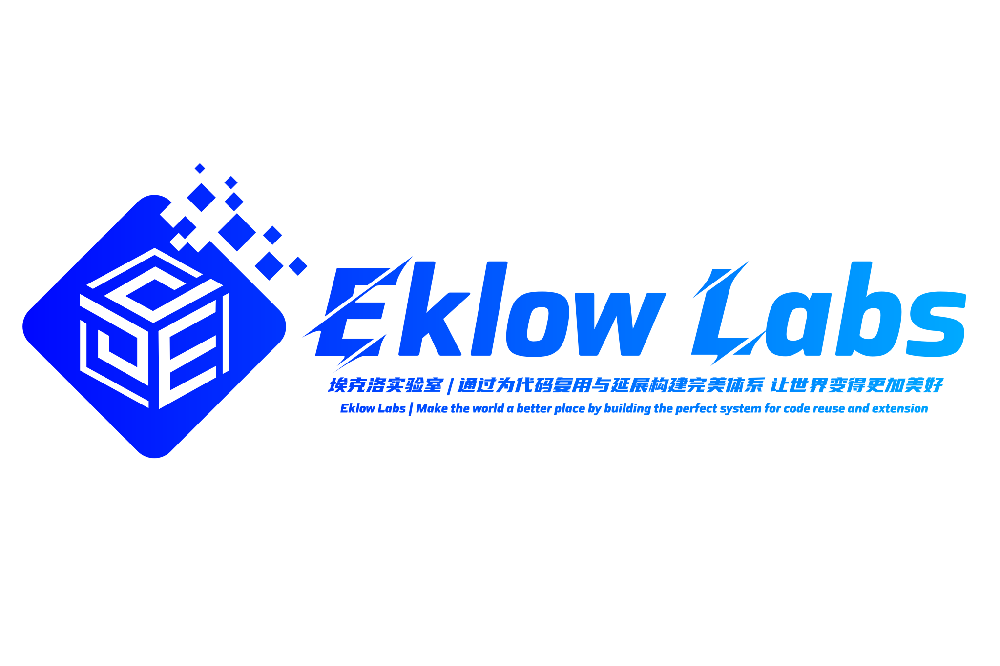

# [Eklow Labs](https://eklowlabs.github.io)

 

------------

  

 

## Domain Exploration Program

| Classification | Explore items | Project Overview | Project Status | 
|:-----:|:-----:|:-----:|:-----:|
|[Artificial Intelligence]() | `Objective-Detection` | Yet Another Darknet 2 Keras | Private (In Progress) |
|[Artificial Intelligence]() | `Semantic-Segmentation-Editor` | Semantic Segmentation | Public (Waiting To Hatch) |
|[Big Data]() | `DataFlow-X` | DataFlow-X Stream Framework | Public (Waiting To Hatch) |
|[Project Document]() | `eklowlabs.github.io` | Eklow Labs (NetWork Station) | Public (Complete) |
|[Project Document]() | `remote_work` | Remote Task Scheduling | Private (Complete) |

## License OpenSource Agreement
 [Apache License Version 2.0](./LICENSE)
 
 ---------
