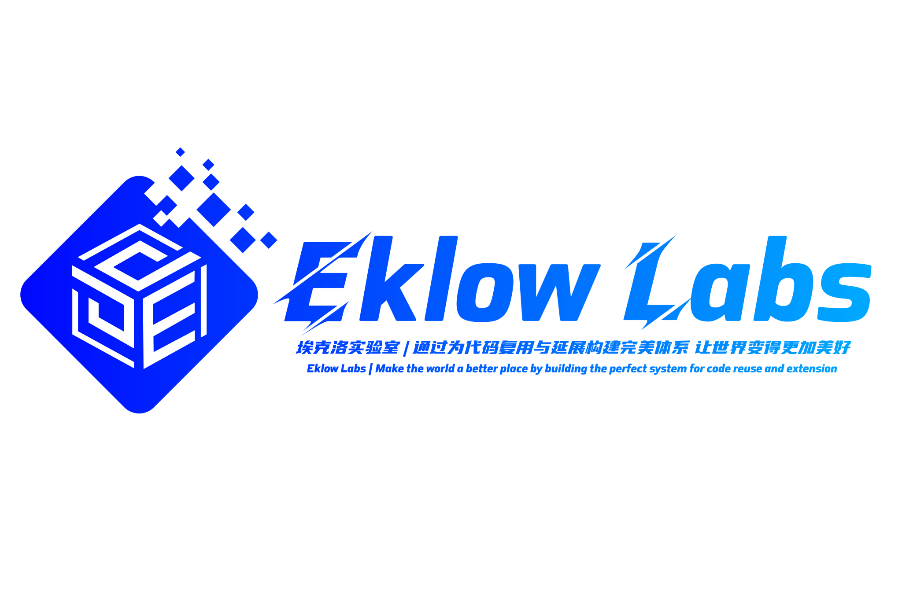

# [埃克洛 实验室](https://eklowlabs.github.io)

<br>

[]()
[](./README_CN.md)
[](./README.md)
[]()
[]()
[]()
[]()
[](https://github.com/geekparkhub)
[](https://github.com/aiparkhub)
[](https://github.com/eklowlabs)
[](https://github.com/eklowlabs)
[](https://github.com/jeep711)

------------

<div align="center">
  
</div>
<br>

# Eklow Labs 联合 ApacheCN 正式发起 "领域探索计划"

## 1. 引言

> 黑客精神思想
- [ ] 在黑客精神思想中提到"世界上仍有大量迷人的事情等待解决", 因此接下来埃克洛实验室将要搞点大动作;


> 什么是领域探索
- [ ] 领域探索是指将深度探索挖掘各个热门行业的技术发展空间, 并以数据/论文/可行性报告等等多形式进行展现, 根据前期论证结果整合目前流行技术构建孵化出适应不同领域技术应用场景或落地应用;
    - 孵化(个人/社区版本)落地应用: 制定未来三年的项目发展规划 / 开源免费机制 / 具备学习领域研究和非商业用途;
    - 孵化(企业/商业版)落地应用: 制定未来三至五年的项目发展规划 / 商业价值/商业计划 / 半开源付费机制 / 具备商业用途;

   
> 领域探索计划 中心思想
- [ ] 阿基米德曾说过: "给我一个支点, 我就能撬动地球", 假设给你一块橡皮泥, 你就能构造出不同造型的产物, 对于我们而言也是如此;
- [ ] "领域探索计划"是源于对科技的一种敬畏, 当看到科学家/数学家等在第一线日夜奋战, 再过度到 Google / Microsoft / FaceBook / Apache / Alibaba / Tencent / HuaWei / BaiDu 等等组织为科技事业而贡献的产物结晶, 再延伸到马斯克为火星计划而悄然准备着, 这一系列的探索过程, 正是人类寻求本真的历程, 也是时代、精神、人文进化的结果, 至今激励着我们向前进步;
- [ ] 作为开发者的角色只是专注于技术本身, 而领域探索计划的角色更多专注于如何让技术产生价值, 如何获得社会效应;
- [ ] 我们希望偏向技术本身,而没有偏向社会问题的解决,这种思维的转变是最大的挑战.
## 2. 正文
> 欢迎你志愿加入该组织开展后续工作, 对于自身而言, 为你所热爱的职业生涯或事业做出一份贡献, 它将会是你人生中的精彩历练与过往历程, 对于组织而言, 目前不仅仅是运行在网络之中的组织, 更是汇聚一切的社会资源作为;


### 2.1 组织概述

- [ ] 组织简介
    - 通过理论研究和实验证明, 致力于在其研究领域, 不断探索挖掘可能具有影响力的项目并将开源贡献至旗下分支组织进行深度孵化;

- [ ] 组织成立时间
    - 2020年;

- [ ] 组织成立背景
    - 继承硅谷美剧中优良文化, 为探索发现孕育而生;

- [ ] 组织类型
    - 互联、物联、科技;

- [ ] 组织文化与定位
    - 将一如既往保持探索精神, 通过理论研究和实验证明快速嗅觉具有影响力的产品;

- [ ] 组织愿景
    - 专注于探索发现, 将艺术与科技完美结合, 致力于用技术的力量突破你的渴望;

- [ ] 组织制度
    - 研发、运营、管理、品牌营销、对外商务合作等专业化组织制度;
    
- [ ] 组织架构
     ``` text
    EklowLabs
        视觉设计
            平面设计
            交互设计
            用户研究
        产品挖掘
            领域探索 团队
        产品研发|深度孵化
            大数据 研发团队
            人工智能 研发团队
            区块链 研发团队
            云计算 边缘计算 研发团队
            其他领域 研发团队
            产品经理
            项目经理
        综合运营
        市场调研
        竞品分析
        市场销售
        媒体|公关
        人事管理
    ```

- [ ] 组织亮点
    - 目前是具备相对专业的管理制度和响应机制, 并且在网络中自由运行的公益与商业组织;
    - 不定期 组织线上&线下面基/聚会/演讲/分享/玩耍;
    - 组织支持资源调配(为有价值或有意义的想法而时刻准备着);

- [ ] 未来 组织规划
    - 制定 研发标准/生产标准;
    - 制定 未来三至五年的组织发展策略;
    - 升级 组织架构;
    - 升级 组织注册知识产权;
    - 升级 组织属性: 独立性经济组织;
    - 升级 组织制度类型: 有限责任公司、股份有限公司;


### 2.1 志愿加入 要求须知
- [x] 硬性要求:
    - 无种族地域歧视;
    - 三观符合、崇尚自由、热爱折腾、热爱技术、热爱分享;
    - ........ ;

- [x] 非需性
    - [ ] 如果你已具备好奇探索之心、具有改变之力, 无论在非技术界和技术界的小白还是大牛, 埃克洛实验室的无国界探索之门将永远开放; 


### 2.2 开放 探索领域
> 分析影响行业发展的各种因素以及判断对行业的影响力度, 预测并应引导行业的未来发展趋势, 判断行业市场价值，揭示行业风向, 制定决策或依据;

> 行业的发展必然遵循由低级的自然资源掠夺性开采利用和低级的人工劳务输出, 逐步向规模经济、科技密集型、金融密集型、人才密集型、知识经济型, 从输出自然资源, 逐步转向输出工业产品、知识产权、高科技人才等;

| 领域分支     |  类别分支  | 说明 |
|--------------|-----------|--------------|
| 农业与矿业 | XXX | XXX   |
| 政府 | XXX | XXX   |
| 生物科技 | XXX | XXX   |
| 教育 | XXX | XXX   |
| 通信 | XXX | XXX   |
| XXX | XXX | XXX   |


### 2.3 开放 职位

#### 2.3.1 技术 职位

| 技术分支 |  职位分支 | 职责简述 | 职位人数 | 
|--------------|-----------|--------------|--------------|
| 物联网 | XXX | XXX   | 目前预留2个职位 / 但随着项目孵化而递减或递增   |
| 云计算&边缘计算 | XXX | XXX  | 目前预留2个职位 / 但随着项目孵化而递减或递增   |
| 人工智能 | XXX | XXX  | 目前预留2个职位 / 但随着项目孵化而递减或递增   |
| 大数据 | XXX | XXX   | 目前预留2个职位 / 但随着项目孵化而递减或递增   |
| 区块链 | XXX | XXX   | 目前预留2个职位 / 但随着项目孵化而递减或递增   |
| 后端开发 | XXX | XXX   | 目前预留2个职位 / 但随着项目孵化而递减或递增   |
| 前端开发 | XXX | XXX   | 目前预留2个职位 / 但随着项目孵化而递减或递增   |
| 移动开发 | XXX | XXX   | 目前预留2个职位 / 但随着项目孵化而递减或递增   |
| 运维/技术支持 | XXX | XXX   | 目前预留2个职位 / 但随着项目孵化而递减或递增   |
| 硬件开发 | XXX | XXX   | 目前预留2个职位 / 但随着项目孵化而递减或递增   |
| 项目管理 | XXX | XXX   | 目前预留2个职位 / 但随着项目孵化而递减或递增   |
| 高端技术 | XXX | XXX   | 目前预留2个职位 / 但随着项目孵化而递减或递增   |

### 2.3.1 待开放 职位
#### 2.3.2 学术 职位
#### 2.3.3 产品 职位
#### 2.3.4 运营 职位
#### 2.3.5 市场 职位
#### 2.3.6 人事 职位
#### 2.3.7 销售 职位
#### 2.3.8 媒体 职位
#### 2.3.9 翻译 职位
#### 2.3.10 金融 职位
#### 2.3.11 管理 职位


### 2.4 工作任务编排

> 工作任务编排 模板 
>
> 探索项目和项目孵化需按照领域分类, 将待审核的探索项目存储至(冷藏室)情节, 如审核通过后转移至(进行中)情节直至测试完成;

| Classification<br>(类别) |  ICE BOX<br>(冷藏室) |  EMERGENCY<br>(紧急情况) |  IN PROGRESS<br>(进行中) |  TESTING<br>(测试中) |   COMPLETE<br>(完成) |
|:-----:|:---------:|:------------:|:-------------:|:--------:|:------------:|
| [AI-Jobs]() | XXX | None | XXX | None | None |
| [AI-Jobs]() | XXX | None | XXX |  None | None |
| [AI-Jobs]() | XXX | None | XXX |  None | None |
| [AI-Jobs]() | XXX | None | XXX |  None | None |
| [AI-Jobs]() | XXX | None | XXX |  None | None |


> 兴趣是你的第一任老师

> 目前将以每周五/周末时间, 自主探索

### 2.5 对接与协作


### 2.6 组织工作制度
> 怀抱自由工作制的同时也要保证任务的质量, 不要求加班;


## 3. 常见问题

## 4. 后记
